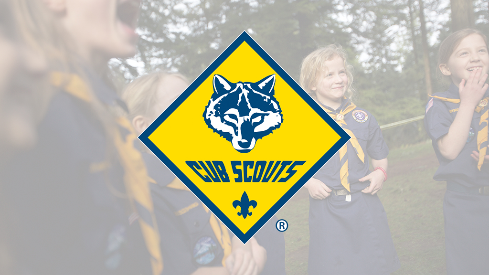

---
# Feel free to add content and custom Front Matter to this file.
# To modify the layout, see https://jekyllrb.com/docs/themes/#overriding-theme-defaults

layout: home
---
<!-- Global site tag (gtag.js) - Google Analytics -->

# [Events](/events)

Pack 299 meets on the first Tuesday of each month at 6:00 pm during the 2022 school year.

For additional information please contact Pack 299 at
<a href="mailto:pack299sandiego@gmail.com?Subject=Pack 299 Info" title="Contact us">pack299sandiego@gmail.com</a>.

Meetings are held at [Clairemont Covenant Church](https://www.clairemontcov.org/) 5255 Mt. Ararat Dr., San Diego, CA  92111

<iframe src="https://www.google.com/maps/embed?pb=!1m14!1m8!1m3!1d6706.647713896549!2d-117.18364000000001!3d32.81018300000001!3m2!1i1024!2i768!4f13.1!3m3!1m2!1s0x80dc000dc0921005%3A0xb7be219b0ae989e4!2s5255+Mt+Ararat+Dr%2C+San+Diego%2C+CA+92111!5e0!3m2!1sen!2sus!4v1548912102359" style="border:0" allowfullscreen="" width="400" height="200" frameborder="0"></iframe>

# Membership

**Potential new members** are encouraged to meet the Pack and Dens and learn about upcoming activities.

Grades K-5 all genders are welcomed to join our Pack.
Kindergarten-age youth can join as [Lions](https://www.sdicbsa.org/Programs/LionProgram.php)

Middle School and High School youth are encouraged to contact either Scout [Troop 11](https://www.troop11.org) or Scout [Troop 260](https://www.troopwebhost.org/Troop260SanDiego/Index.htm)

[Why Join Scouting Information](https://i9peu1ikn3a16vg4e45rqi17-wpengine.netdna-ssl.com/wp-content/uploads/2020/06/512-73520-Welcome-New-CS-Family_WEB_FPDF.pdf)

<iframe width="560" height="315" src="https://www.youtube.com/embed/-wUZ_yeY9qc" frameborder="0" allow="accelerometer; autoplay; encrypted-media; gyroscope; picture-in-picture" allowfullscreen></iframe>

Email us <a href="mailto:pack299sandiego@gmail.com?Subject=Pack 299 Info" title="Contact us">pack299sandiego@gmail.com</a> for more info.

## External Links

[Online Registration](https://beascout.scouting.org/list/?zip=92117&program%5B0%5D=pack&cubFilter=all&miles=10&unitID=249742) to fill in info online. Click the "Apply Now" button and then the "Create Account" button on the my.scouting.org website.

[Shutterfly](https://pack299sandiego.shutterfly.com) is used for private Pack/Den communications

[Pack 299 Facebook Page](https://www.facebook.com/Pack-299-San-Diego-Clairemont-Cub-Scouts-2020-2021-115635906923017/)

[San Diego/Imperial Council](http://www.sdicbsa.org/) site has local info and events for Mataguay Scout Ranch, Camp Balboa, and the Youth Aquatic Center on Fiesta Island.

> The Council is broken down into these [Districts/Zones](https://www.sdicbsa.org/Zones/Images/ZoneMap.jpg). We are in Costal Sage

> [Costal Sage District/Zone Website](https://coastalsage.sdicbsa.org/)

> [Costal Sage Facebook Group](https://www.facebook.com/CoastalSageBSA/)

[National Site](https://www.scouting.org/programs/cub-scouts/) for information on Cub Scouts in the US and online store.
